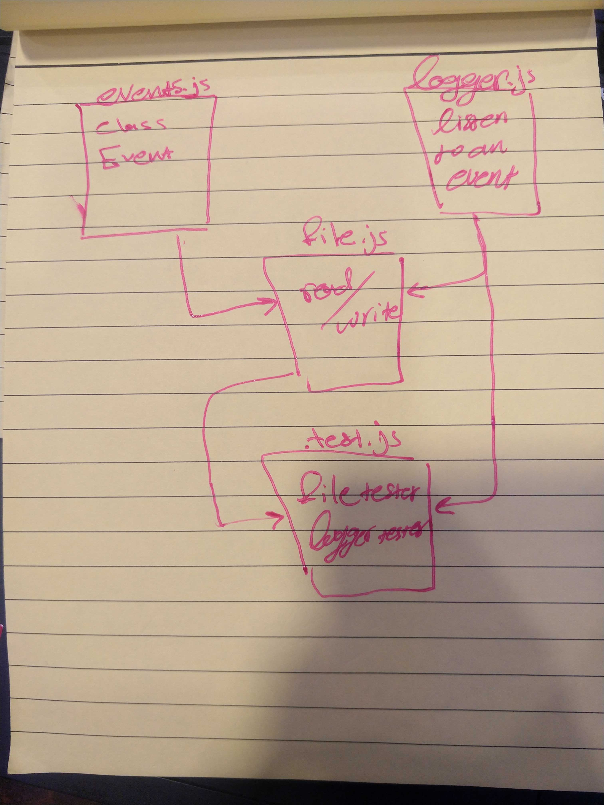

# LAB - Class 16

## Event Driven Applications

### Author: naseem

### Links and Resources

- [submission PR](https://github.com/naseem-401-advanced-javascript/lab-16)

### Setup

#### How to initialize/run your application (where applicable)

- `npm run start`

#### Tests

- How do you run tests?
- `npm run test`
- Any tests of note?
- Describe any tests that you did not complete, skipped, etc

#### UML

